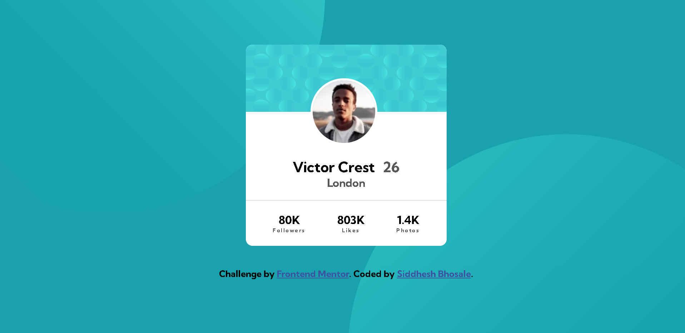
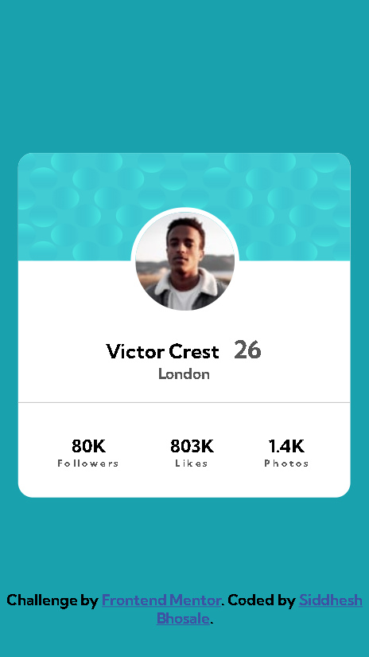

# Frontend Mentor - Profile card component solution

This is a solution to the [Profile card component challenge on Frontend Mentor](https://www.frontendmentor.io/challenges/profile-card-component-cfArpWshJ). Frontend Mentor challenges help you improve your coding skills by building realistic projects. 

## Table of contents

- [Overview](#overview)
  - [The challenge](#the-challenge)
  - [Screenshot](#screenshot)
  - [Links](#links)
- [My process](#my-process)
  - [Built with](#built-with)
  - [What I learned](#what-i-learned)
  - [Continued development](#continued-development)
- [Author](#author)

## Overview

### The challenge

- Build out the project to the designs provided by Frontend Mentor.

### Screenshot

----> Desktop Look

----> Mobile Look

### Links

- Solution URL: [Add solution URL here](https://your-solution-url.com)
- Live Site URL: [Add live site URL here](https://your-live-site-url.com)

## My process

### Built with

- Semantic HTML5 markup
- CSS custom properties
- Flexbox
- Mobile-first workflow

### What I learned

- Practice positions in CSS.

### Continued development

Responsive Web App that want to continue focusing on in future projects. 

## Author

- Website - [Siddhesh](https://siddhesh-coder.github.io/SiddheshsPortfolio.github.io/)
- Frontend Mentor - [@siddhesh-coder](https://www.frontendmentor.io/profile/siddhesh-coder)
- Twitter - [@Siddhes16213591](https://twitter.com/Siddhes16213591)
